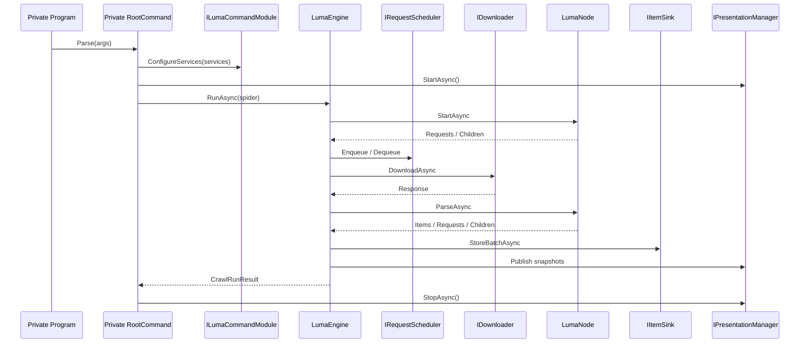
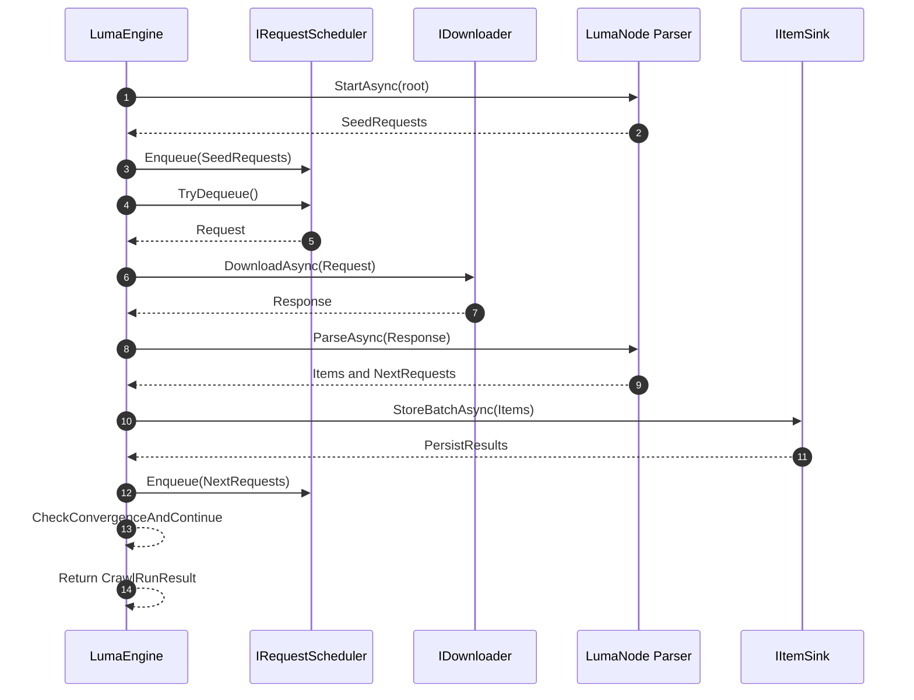

# Zeayii.Luma Architecture

[简体中文](./ARCHITECTURE.md) | English

## 1. Goals

1. Keep Scrapy-style responsibility boundaries across host, engine, and presentation.
2. Enable fast private-provider integration without coupling to the official CLI template.
3. Support observable, cancellable, and extensible long-running crawling workloads.

## 2. Project-Level Modules

- `Zeayii.Luma.Abstractions`
  - Stable public contracts
  - Shared request/response/parse/persistence models
- `Zeayii.Luma.Engine`
  - Scheduling, download driving, parse orchestration, persistence orchestration
  - Completion convergence and stop strategy
- `Zeayii.Luma.Presentation`
  - Terminal logs and progress rendering
- `Zeayii.Luma.CommandLine` (sample)
  - Official host reference, not the stable SDK surface
- `Zeayii.Luma.Generators` (sample)
  - Official generator reference, not the stable SDK surface

## 3. Assembly-Level View

- `Zeayii.Luma.Abstractions.dll`
  - `ILumaCommandModule`
  - `ISpider` / `LumaNode`
  - `LumaRequest` / `LumaResponse` / `PersistResult`
- `Zeayii.Luma.Engine.dll`
  - `LumaEngine`
  - default `IRequestScheduler` implementation
  - default `IDownloader` implementation
- `Zeayii.Luma.Presentation.dll`
  - default `IPresentationManager` implementation
  - snapshot rendering components
- `luma` (sample executable)
  - exists only in `Zeayii.Luma.CommandLine`

## 4. External Dependency Boundary

Recommended for private consumers:

1. Always reference `Abstractions + Engine`.
2. Add `Presentation` only when unified terminal output is needed.
3. Do not depend on `CommandLine` or `Generators`; implement private provider subcommands yourself.

## 5. Lifecycle Sequence

## 6. Runtime Internal Sequence (Engine Loop, GitHub Render Friendly)

## 7. Key Constraints

1. Command modules rely on static contracts and do not require public parameterless constructors.
2. Node registration and node-map update must be atomic.
3. Completion convergence must be signal-driven (no fixed-delay polling).
4. Downloader must honor timeout, cancellation, and response-body limits.
5. Cancellation must not be swallowed and should propagate to scheduling layers.
6. Persistence failures must not break runtime convergence semantics.

## 8. Private Extension Workflow

1. Implement `ILumaCommandModule` for provider subcommand definition.
2. Register `ISpider`, `IItemSink`, and provider services in the module.
3. Split crawl and parse phases with `LumaNode` boundaries.
4. Implement idempotent write and conflict handling in `IItemSink`.
5. Unify runtime output style through `IPresentationManager`.

## 9. Release Gates

1. `dotnet build Zeayii.Luma.sln -c Release` passes.
2. `dotnet test Zeayii.Luma.Tests/Zeayii.Luma.Tests.csproj -c Release` passes.
3. One smoke run of private provider subcommands is successful.
4. Cancellation, timeout, and failure paths have reproducible verification records.
