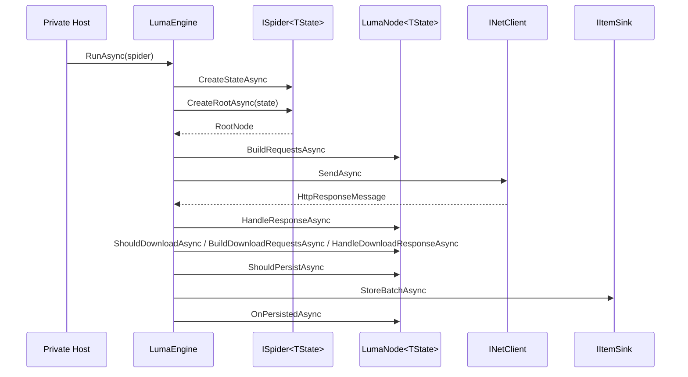

# Zeayii.Luma Architecture

[简体中文](./ARCHITECTURE.md) | English

## 1. Architecture Goals

1. Keep Node as the only provider-facing extension surface.
2. Centralize request execution and concurrency governance in the framework.
3. Keep persistence extensible while maintaining a unified execution path.
4. Provide an observable, cancellable, convergent runtime loop.

## 2. Layered Boundaries

- `ISpider<TState>`
  - Creates run state and provides the root node.
- `LumaNode<TState>`
  - Represents a business semantic step.
  - Describes requests, parses responses, creates child nodes, and handles persistence callbacks.
- `LumaEngine`
  - Scheduling, downloading, lifecycle driving, persistence execution, stop decisions, snapshot publishing.
- `IItemSink`
  - Persistence write entry.
- `IPresentationManager`
  - Presentation layer only.

## 3. Node Lifecycle

1. `BuildRequestsAsync(context)`
- Request-build stage that emits initial request stream.

2. `HandleResponseAsync(response, context)`
- Normal response stage where node accumulates follow-up requests, children, and items.

3. Download stages (optional)
- `ShouldDownloadAsync(response, context)`
- `BuildDownloadRequestsAsync(response, context)`
- `HandleDownloadResponseAsync(response, request, context)`

4. `ShouldPersistAsync(item, persistContext)`
- Node-level persistence filter.

5. `OnPersistedAsync(item, persistResult, persistContext)`
- Node-level persistence callback.

## 4. Data Model Semantics

1. `NodeDispatchBatch`
- `Requests`
- `Children`
- `Items`
- `StopNode` / `StopReason`

2. `NodeExecutionOptions`
- `ChildMaxConcurrency`

3. `LumaContext<TState>`
- Runtime metadata (RunId, RunName, Path, Depth)
- Resource capability functions (for example HTML parsing and Cookie operations)
- `CancellationToken`
4. `NodeExecutionOptions.DefaultRouteKind`
- Node default route kind.
- Request and Cookie operations use node default route unless explicitly overridden.

## 5. Runtime Flow

## 6. Scheduling and Concurrency

1. Global concurrency is controlled by Engine.
2. Child expansion concurrency is declared per node via `ChildMaxConcurrency`.
3. Child expansion concurrency is declared per node via `ChildMaxConcurrency`.
4. Queue backpressure is enforced by the scheduler.

## 7. Design Constraints

1. Nodes do not call database APIs directly.
2. Nodes do not implement custom downloaders or schedulers.
3. Engine does not contain provider-specific parsing logic.
4. Cancellation must propagate end-to-end.
5. Persistence failures must be observable and must not break convergence.

## 8. Stop Semantics

1. Nodes can actively request stop by throwing `LumaStopException`.
2. `LumaStopScope.Node`: stop only the current node and its downstream subtree.
3. `LumaStopScope.Run`: stop the current run.
4. `LumaStopScope.App`: bubble to host so the host decides application-level shutdown.
5. Keep `OperationCanceledException` for external cancellation (for example Ctrl+C), separated from business stop semantics.

## 9. Private Extension Workflow

1. Implement `ISpider<TState>` to create state and return the root node.
2. Implement the node tree and lifecycle logic.
3. Implement `IItemSink` for persistence and conflict handling.
4. Wire everything in your private host DI container.
