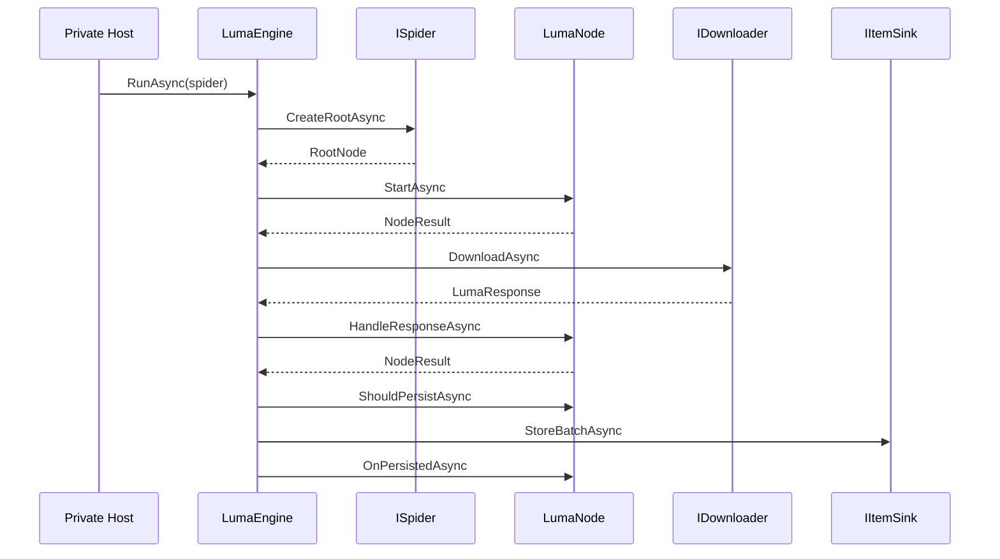

# Zeayii.Luma Architecture

[简体中文](./ARCHITECTURE.md) | English

## 1. Architecture Goals

1. Keep Node as the only provider-facing extension surface.
2. Centralize request execution and concurrency governance in the framework.
3. Keep persistence extensible while maintaining a unified execution path.
4. Provide an observable, cancellable, convergent runtime loop.

## 2. Layered Boundaries

- `ISpider`
  - Provides only the root node.
- `LumaNode`
  - Represents a business semantic step.
  - Describes requests, parses responses, creates child nodes, and handles persistence callbacks.
- `LumaEngine`
  - Scheduling, downloading, lifecycle driving, persistence execution, stop decisions, snapshot publishing.
- `IItemSink`
  - Persistence write entry.
- `IPresentationManager`
  - Presentation layer only.

## 3. Node Lifecycle

1. `StartAsync(context)`
- Startup stage that emits an initial `NodeResult`.

2. `HandleResponseAsync(response, context)`
- Response stage that emits next requests, children, and items.

3. `ShouldPersistAsync(item, persistContext)`
- Node-level persistence filter.

4. `OnPersistedAsync(item, persistResult, persistContext)`
- Node-level persistence callback.

## 4. Data Model Semantics

1. `NodeResult`
- `Requests`
- `Children`
- `Items`
- `StopNode` / `StopReason`

2. `NodeExecutionOptions`
- `ChildTraversalPolicy`: `Breadth` / `Depth`
- `ChildMaxConcurrency`

3. `LumaNodeContext`
- Runtime metadata (RunId, RunName, Path, Depth)
- Resource capability functions (for example HTML parsing and Cookie operations)
- `CancellationToken`

## 5. Runtime Flow

## 6. Scheduling and Concurrency

1. Global concurrency is controlled by Engine.
2. Child expansion concurrency is declared per node via `ChildMaxConcurrency`.
3. Child traversal order is declared per node via `ChildTraversalPolicy`.
4. Queue backpressure is enforced by the scheduler.

## 7. Design Constraints

1. Nodes do not call database APIs directly.
2. Nodes do not implement custom downloaders or schedulers.
3. Engine does not contain provider-specific parsing logic.
4. Cancellation must propagate end-to-end.
5. Persistence failures must be observable and must not break convergence.

## 8. Private Extension Workflow

1. Implement `ISpider` to return the root node.
2. Implement the node tree and lifecycle logic.
3. Implement `IItemSink` for persistence and conflict handling.
4. Wire everything in your private host DI container.
