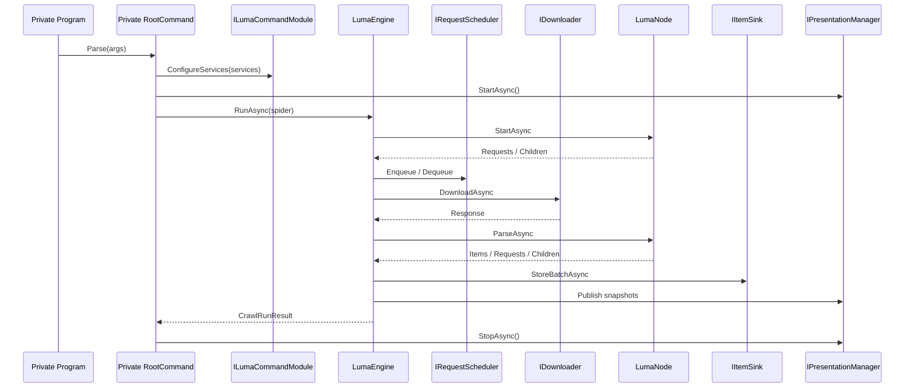
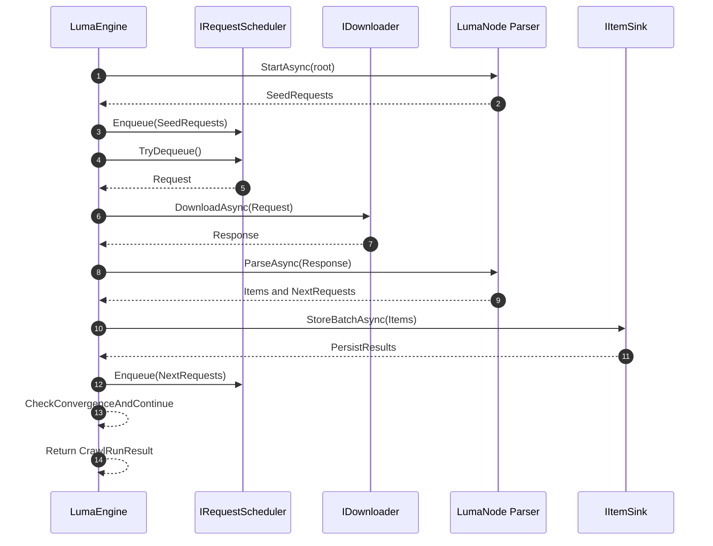

# Zeayii.Luma 架构规范

简体中文 | [English](./ARCHITECTURE.en.md)

## 1. 架构目标

1. 维持 Scrapy 风格职责分层，避免宿主、引擎、展示耦合。
2. 支持私有站点实现快速接入，不绑定官方命令行模板。
3. 支持可观测、可中断、可扩展的长期运行抓取。

## 2. 项目维度（Project）

- `Zeayii.Luma.Abstractions`
  - 对外稳定契约
  - 共享请求/响应/解析/持久化模型
- `Zeayii.Luma.Engine`
  - 请求调度、下载驱动、解析调度、持久化调度
  - 收敛判定和停止策略
- `Zeayii.Luma.Presentation`
  - 终端日志与进度输出
- `Zeayii.Luma.CommandLine`（示范）
  - 官方参考宿主，不作为 SDK 稳定面
- `Zeayii.Luma.Generators`（示范）
  - 官方参考生成器，不作为 SDK 稳定面

## 3. 程序集维度（Assembly）

- `Zeayii.Luma.Abstractions.dll`
  - `ILumaCommandModule`
  - `ISpider` / `LumaNode`
  - `LumaRequest` / `LumaResponse` / `PersistResult`
- `Zeayii.Luma.Engine.dll`
  - `LumaEngine`
  - `IRequestScheduler` 默认实现
  - `IDownloader` 默认实现
- `Zeayii.Luma.Presentation.dll`
  - `IPresentationManager` 默认实现
  - 快照渲染组件
- `luma`（示范可执行程序）
  - 仅在 `Zeayii.Luma.CommandLine` 中存在

## 4. 外部依赖边界

外部私有项目建议：

1. 强制依赖 `Abstractions + Engine`。
2. 需要统一终端输出时再依赖 `Presentation`。
3. 不依赖 `CommandLine` 与 `Generators`，自行实现 provider 子命令入口。

## 5. 生命周期时序

## 6. 运行时内部时序（Engine Loop，GitHub 渲染版）

## 7. 关键设计约束

1. 命令模块依赖静态契约，不要求 public 无参构造。
2. 节点注册与节点字典更新必须原子化。
3. 完成收敛使用信号驱动，避免固定延迟轮询。
4. 下载器必须支持请求级超时、取消和响应体上限。
5. 取消信号不能被静默吞掉，必须传播到调度层。
6. 持久化失败不应破坏引擎终止收敛逻辑。

## 8. 私有扩展标准流程

1. 实现 `ILumaCommandModule` 定义 provider 子命令。
2. 在模块中注册 `ISpider`、`IItemSink`、站点专属服务。
3. 通过 `LumaNode` 拆分页面抓取和解析阶段。
4. 在 `IItemSink` 中实现幂等插入与冲突处理。
5. 通过 `IPresentationManager` 统一输出风格。

## 9. 发布门禁

1. `dotnet build Zeayii.Luma.sln -c Release` 通过。
2. `dotnet test Zeayii.Luma.Tests/Zeayii.Luma.Tests.csproj -c Release` 通过。
3. 私有 provider 子命令可被完整执行一次烟测。
4. 取消、超时、失败三条路径有可复现验证记录。
