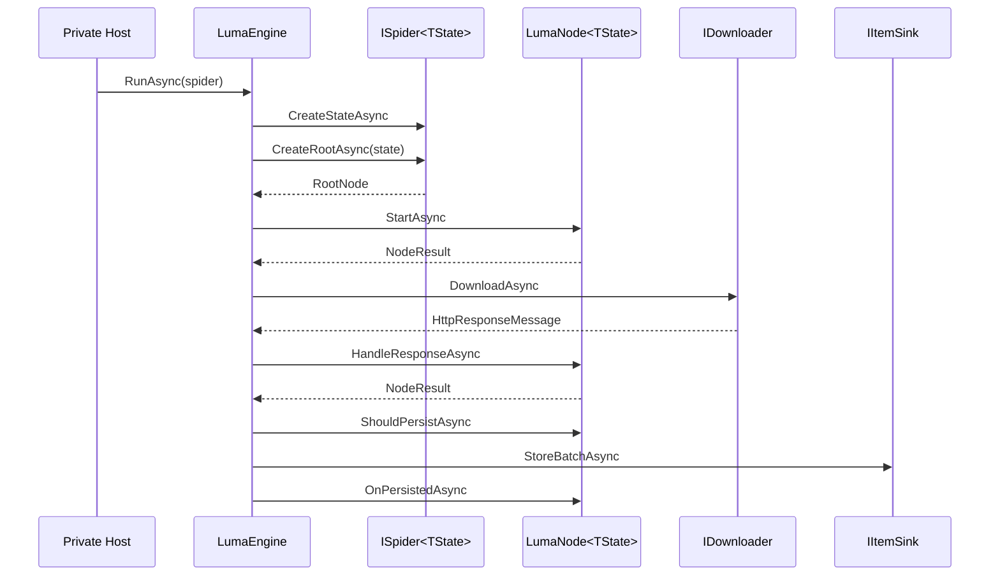

# Zeayii.Luma 架构规范

简体中文 | [English](./ARCHITECTURE.en.md)

## 1. 架构目标

1. 以 Node 为唯一业务扩展面，降低 provider 实现复杂度。
2. 将请求链路与并发调度收敛到框架层统一治理。
3. 让持久化策略可扩展，同时保持执行路径统一。
4. 提供可观测、可取消、可收敛的运行时闭环。

## 2. 分层与边界

- `ISpider<TState>`
  - 创建运行状态并提供根节点。
- `LumaNode<TState>`
  - 业务语义步骤。
  - 负责请求描述、响应解析、子节点创建、持久化策略回调。
- `LumaEngine`
  - 调度、下载、生命周期驱动、持久化执行、停止判定、快照发布。
- `IItemSink`
  - 持久化写入入口。
- `IPresentationManager`
  - 展示层，不参与业务执行决策。

## 3. Node 生命周期

1. `StartAsync(context)`
- 节点启动阶段，产出初始 `NodeResult`。

2. `HandleResponseAsync(response, context)`
- 响应处理阶段，产出后续请求、子节点与数据项。

3. `ShouldPersistAsync(item, persistContext)`
- 节点级持久化过滤。

4. `OnPersistedAsync(item, persistResult, persistContext)`
- 节点级持久化回调。

## 4. 数据模型语义

1. `NodeResult`
- `Requests`
- `Children`
- `Items`
- `StopNode` / `StopReason`

2. `NodeExecutionOptions`
- `ChildTraversalPolicy`：`Breadth` / `Depth`
- `ChildMaxConcurrency`

3. `LumaContext<TState>`
- 运行元信息（RunId、RunName、Path、Depth）
- 资源能力函数（例如 HTML 解析、Cookie 读写）
- `CancellationToken`
4. `NodeExecutionOptions.DefaultRouteKind`
- 节点默认路由类型。
- 请求与 Cookie 操作在未显式覆盖时优先采用节点默认路由。

## 5. 运行时流程

## 6. 调度与并发策略

1. 全局并发由引擎统一控制。
2. 子节点并发由节点 `ChildMaxConcurrency` 声明。
3. 子节点遍历顺序由节点 `ChildTraversalPolicy` 声明。
4. 队列背压由调度器实现，避免无限入队。

## 7. 设计约束

1. Node 不直接调用数据库接口。
2. Node 不直接实现下载器与调度器。
3. Engine 不承载 provider 专属解析逻辑。
4. 取消信号必须全链路传播。
5. 持久化失败必须可观测且不破坏收敛逻辑。

## 8. 停止语义

1. Node 可通过抛出 `LumaStopException` 主动触发停止。
2. `LumaStopScope.Node`：仅停止当前节点及其下游。
3. `LumaStopScope.Run`：停止当前整次运行。
4. `LumaStopScope.App`：上抛到宿主，由宿主决定应用级停机策略。
5. `OperationCanceledException` 保留外部取消语义（例如 Ctrl+C），不与业务停止语义混用。

## 9. 私有扩展流程

1. 实现 `ISpider<TState>`，创建状态并返回根节点。
2. 实现 Node 树并定义生命周期逻辑。
3. 实现 `IItemSink` 处理入库与冲突。
4. 在私有宿主中完成 DI 组装。
