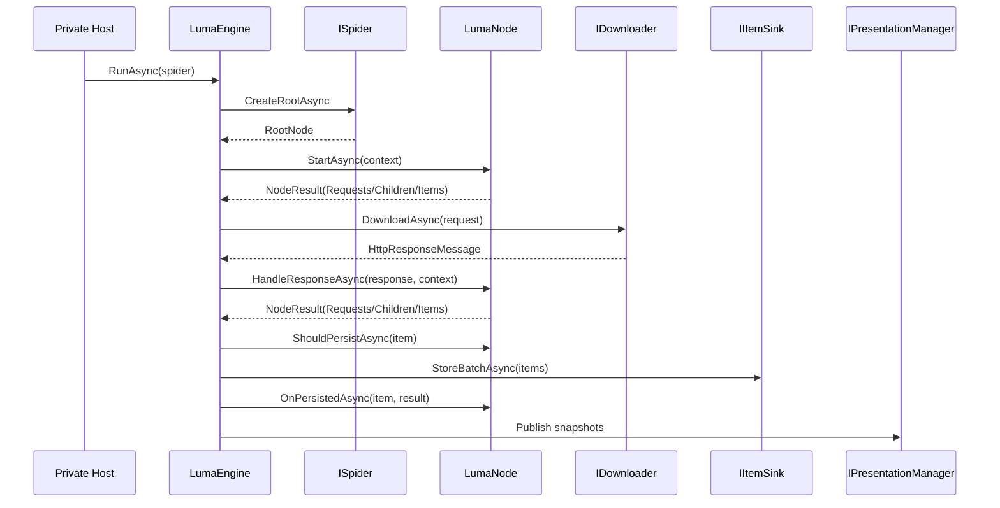

# Zeayii.Luma

[简体中文](./README.md) | English

Zeayii.Luma is a Node-driven crawling runtime framework for private provider integrations.

## 1. Design Principles

1. Users implement Nodes, not schedulers.
2. `ISpider` only provides the root node.
3. The framework owns request execution, concurrency, backpressure, persistence, and observability.
4. Nodes declare traversal and child-concurrency preferences through options.
5. Persistence execution is centralized in Engine; nodes only filter and receive callbacks.

## 2. Module Responsibilities

- `Zeayii.Luma.Abstractions`
  - Public contracts and shared models.
  - Node lifecycle and context definitions.
- `Zeayii.Luma.Engine`
  - Node runtime executor.
  - Downloading, scheduling, persistence, stop decisions, and snapshot publishing.
- `Zeayii.Luma.Presentation`
  - Terminal runtime rendering.
- `Zeayii.Luma.CommandLine`
  - Official sample host.
- `Zeayii.Luma.Generators`
  - Official sample generator.

## 3. Core Contracts

1. `ISpider.CreateRootAsync`: provides the root node.
2. `LumaNode` lifecycle:
- `StartAsync`
- `HandleResponseAsync`
- `ShouldPersistAsync`
- `OnPersistedAsync`
3. `NodeResult`: stage output container (`Requests` / `Children` / `Items` / stop signal).
4. `NodeExecutionOptions`:
- `ChildTraversalPolicy`
- `ChildMaxConcurrency`
5. `LumaNodeContext`: runtime metadata + resource capability functions (for example HTML parsing and Cookie operations).

## 4. Runtime Flow



## 5. Consumer Guidance

1. Private projects should reference `Abstractions + Engine`.
2. Add `Presentation` only when terminal rendering is required.
3. Build your own host and module wiring in private repositories.
4. Provider modules should only model node trees and persistence payloads.

## 6. Build

```bash
dotnet build Zeayii.Luma.sln -v minimal
```

## 7. Documentation Index

- Architecture: [ARCHITECTURE.en.md](./ARCHITECTURE.en.md)
- Abstractions: [Zeayii.Luma.Abstractions/README.en.md](./Zeayii.Luma.Abstractions/README.en.md)
- Engine: [Zeayii.Luma.Engine/README.en.md](./Zeayii.Luma.Engine/README.en.md)
- Presentation: [Zeayii.Luma.Presentation/README.en.md](./Zeayii.Luma.Presentation/README.en.md)
