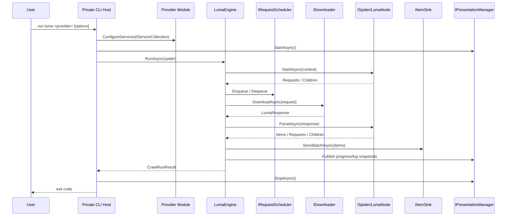
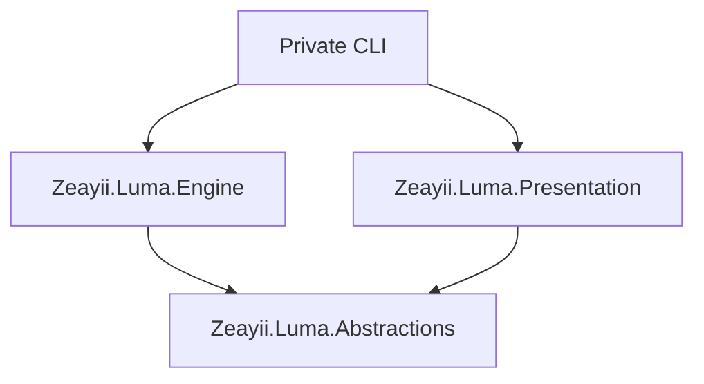

# Zeayii.Luma

[简体中文](./README.md) | English

Zeayii.Luma is a modular crawling runtime framework aligned with Scrapy-style boundaries:

1. Spider owns provider logic.
2. Engine owns scheduling, downloading, parse orchestration, and convergence.
3. Presentation owns runtime observability.
4. CommandLine and Generators are official samples, not the public production entry contract.

## 1. Module Responsibilities

- `Zeayii.Luma.Abstractions`: contracts and shared models.
- `Zeayii.Luma.Engine`: crawling runtime engine.
- `Zeayii.Luma.Presentation`: terminal progress/log rendering.
- `Zeayii.Luma.CommandLine`: official host sample (not published to NuGet).
- `Zeayii.Luma.Generators`: official source-generator sample (not published to NuGet).

## 2. Dependency Guidance for External Users

Recommended minimal dependency set:

1. Required: `Zeayii.Luma.Abstractions`
2. Required: `Zeayii.Luma.Engine`
3. Recommended: `Zeayii.Luma.Presentation` (when consistent terminal UX is required)

Notes:

- Private projects should implement their own CLI host (for example `luma dmm ...`).
- `CommandLine` and `Generators` demonstrate patterns and are not part of the stable public SDK surface.

## 3. End-to-End Flow



## 4. How External Projects Should Use Luma

### 4.1 Integration Steps

1. Create a private CLI project (for example `YourCompany.Luma.Dmm`).
2. Reference `Abstractions + Engine`, optionally `Presentation`.
3. Implement `ILumaCommandModule` for subcommand metadata and DI registration.
4. Implement `ISpider` and `LumaNode` for crawl topology and parsing.
5. Implement `IItemSink` for database persistence and conflict handling.
6. Wire provider subcommands in your private root command.

### 4.2 Minimal Dependency Graph



## 5. Runtime Semantics

1. Completion is signal-driven rather than fixed-delay polling.
2. Downloader is streaming and response-body bounded.
3. Request timeout is controlled by `LumaRequest.Timeout`.
4. Cancellation is propagated and never swallowed.
5. Node registration is atomic to avoid duplicate registration.

## 6. Build and Publish

```bash
dotnet build Zeayii.Luma.sln -v minimal
```

```bash
dotnet test Zeayii.Luma.sln -v minimal
```

AOT publish command for private host sample (not for NuGet package publishing):

```bash
dotnet publish Zeayii.Luma.CommandLine/Zeayii.Luma.CommandLine.csproj -c Release -r win-x64 -p:PublishAot=true -p:PublishSingleFile=true -p:SelfContained=true -p:PublishTrimmed=true
```

## 7. Documentation Index

- Architecture: [ARCHITECTURE.en.md](./ARCHITECTURE.en.md)
- Abstractions: [README.en.md](./Zeayii.Luma.Abstractions/README.en.md)
- Engine: [README.en.md](./Zeayii.Luma.Engine/README.en.md)
- Presentation: [README.en.md](./Zeayii.Luma.Presentation/README.en.md)
- Host sample: [README.en.md](./Zeayii.Luma.CommandLine/README.en.md)
- Generator sample: [README.en.md](./Zeayii.Luma.Generators/README.en.md)
