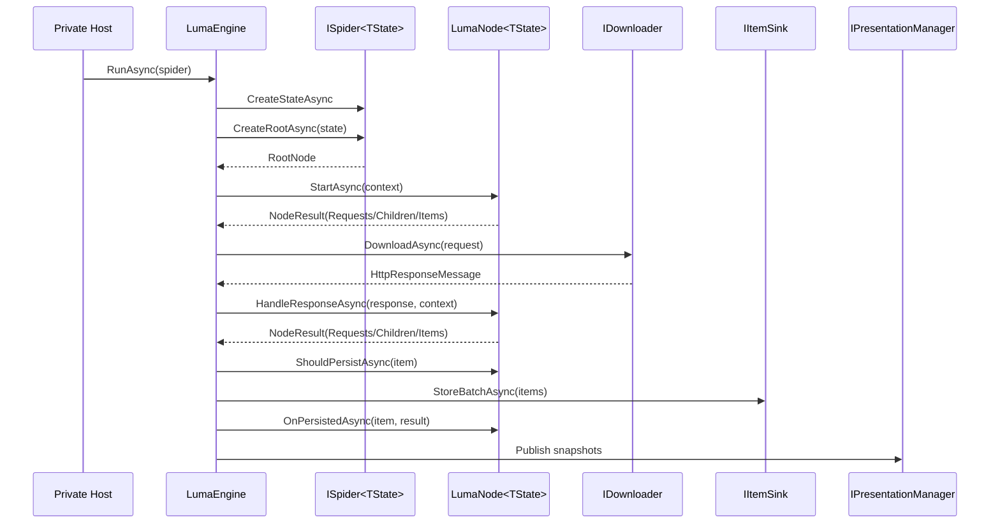

# Zeayii.Luma

简体中文 | [English](./README.en.md)

Zeayii.Luma 是一个面向站点抓取场景的 Node 驱动运行时框架。

## 1. 设计原则

1. 用户只实现 Node，不实现请求调度器。
2. `ISpider<TState>` 负责创建运行状态并提供根节点，不承载解析流程。
3. 框架统一负责请求执行、并发控制、背压、持久化与观测。
4. 节点通过声明式选项控制子节点遍历策略和并发上限。
5. 持久化由框架统一执行，节点只决定是否持久化与持久化后回调。

## 2. 模块职责

- `Zeayii.Luma.Abstractions`
  - 公共契约与共享模型。
  - Node 生命周期与上下文定义。
- `Zeayii.Luma.Engine`
  - Node 执行器。
  - 请求下载、调度、持久化、停止判定与快照发布。
- `Zeayii.Luma.Presentation`
  - 终端运行态展示。
- `Zeayii.Luma.CommandLine`
  - 官方示例宿主。
- `Zeayii.Luma.Generators`
  - 官方示例生成器。

## 3. 核心抽象

1. `ISpider<TState>`：
- `CreateStateAsync`
- `CreateRootAsync(state, cancellationToken)`
2. `LumaNode<TState>` 生命周期：
- `StartAsync`
- `HandleResponseAsync`
- `ShouldPersistAsync`
- `OnPersistedAsync`
3. `NodeResult`：节点阶段产出对象（`Requests` / `Children` / `Items` / 停止信号）。
4. `NodeExecutionOptions`：
- `ChildTraversalPolicy`
- `ChildMaxConcurrency`
5. `LumaContext<TState>`：运行元信息 + 资源能力函数（如 HTML 解析、Cookie 读写）。
6. `NodeExecutionOptions` 还包含 `DefaultRouteKind`，用于节点默认请求/会话路由。

## 4. 运行流程



## 5. 外部接入建议

1. 私有项目依赖 `Abstractions + Engine`。
2. 按需依赖 `Presentation`。
3. 使用私有宿主组装命令行与 provider 模块。
4. provider 侧仅实现 Node 树与数据落库模型。

## 6. 构建

```bash
dotnet build Zeayii.Luma.sln -v minimal
```

## 7. 文档导航

- 架构规范：[ARCHITECTURE.md](./ARCHITECTURE.md)
- 抽象层：[Zeayii.Luma.Abstractions/README.md](./Zeayii.Luma.Abstractions/README.md)
- 引擎层：[Zeayii.Luma.Engine/README.md](./Zeayii.Luma.Engine/README.md)
- 呈现层：[Zeayii.Luma.Presentation/README.md](./Zeayii.Luma.Presentation/README.md)
