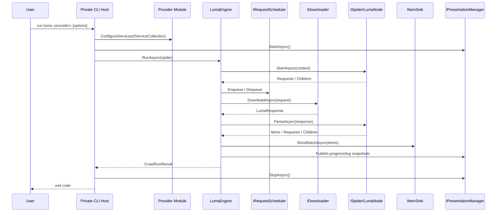
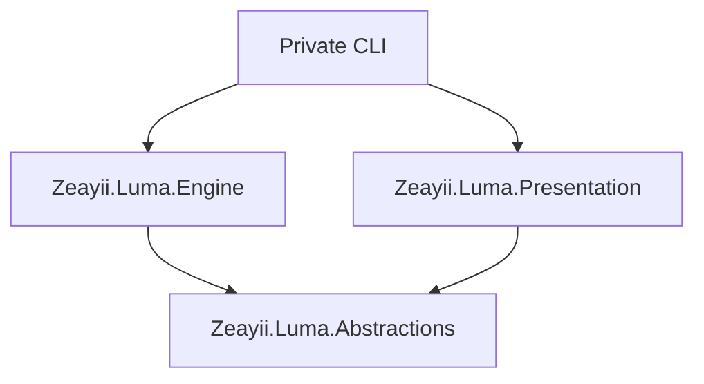

# Zeayii.Luma

简体中文 | [English](./README.en.md)

Zeayii.Luma 是一个面向网站抓取场景的模块化运行时框架，职责边界对齐 Scrapy 思路：

1. Spider 负责站点业务逻辑。
2. Engine 负责调度、下载、解析驱动和收敛停止。
3. Presentation 负责终端可观测输出。
4. CommandLine 和 Generators 仅作为官方示范，不建议外部项目直接复用为生产入口。

## 1. 模块职责总览

- `Zeayii.Luma.Abstractions`：抽象契约与共享模型。
- `Zeayii.Luma.Engine`：抓取运行时引擎。
- `Zeayii.Luma.Presentation`：终端进度和日志呈现。
- `Zeayii.Luma.CommandLine`：官方示范命令行宿主（不发布到 NuGet）。
- `Zeayii.Luma.Generators`：官方示范源码生成器（不发布到 NuGet）。

## 2. 对外依赖建议

推荐外部项目最小依赖组合：

1. 必选：`Zeayii.Luma.Abstractions`
2. 必选：`Zeayii.Luma.Engine`
3. 建议：`Zeayii.Luma.Presentation`（需要统一终端输出时）

说明：

- 外部私有项目应自行实现命令行入口（例如 `luma dmm ...`）。
- `CommandLine` 和 `Generators` 仅用于展示官方推荐接入模式，不作为公共 SDK 稳定面。

## 3. 端到端流程



## 4. 外部用户使用方式

### 4.1 私有项目接入步骤

1. 新建私有命令行项目（例如 `YourCompany.Luma.Dmm`）。
2. 引用 `Abstractions + Engine`，按需引用 `Presentation`。
3. 实现 `ILumaCommandModule`，定义子命令元数据和 DI 注册。
4. 实现 `ISpider` 与 `LumaNode`，定义抓取拓扑和解析逻辑。
5. 实现 `IItemSink`，负责数据库写入与冲突处理。
6. 在私有根命令中挂载 provider 子命令并运行。

### 4.2 最小依赖图



## 5. 关键运行语义

1. 完成判定为信号驱动，不依赖固定轮询延迟。
2. 下载器使用流式读取并限制响应体大小。
3. 请求级超时由 `LumaRequest.Timeout` 驱动。
4. 取消语义向上层传播，不吞掉取消异常。
5. 节点注册保证原子性，避免重复注册。

## 6. 构建与发布

```bash
dotnet build Zeayii.Luma.sln -v minimal
```

```bash
dotnet test Zeayii.Luma.sln -v minimal
```

仅用于私有示范宿主的 AOT 发布（非 NuGet 包）：

```bash
dotnet publish Zeayii.Luma.CommandLine/Zeayii.Luma.CommandLine.csproj -c Release -r win-x64 -p:PublishAot=true -p:PublishSingleFile=true -p:SelfContained=true -p:PublishTrimmed=true
```

## 7. 文档导航

- 架构规范：[ARCHITECTURE.md](./ARCHITECTURE.md)
- 抽象层：[README.md](./Zeayii.Luma.Abstractions/README.md)
- 引擎层：[README.md](./Zeayii.Luma.Engine/README.md)
- 呈现层：[README.md](./Zeayii.Luma.Presentation/README.md)
- 宿主示例：[README.md](./Zeayii.Luma.CommandLine/README.md)
- 生成器示例：[README.md](./Zeayii.Luma.Generators/README.md)
