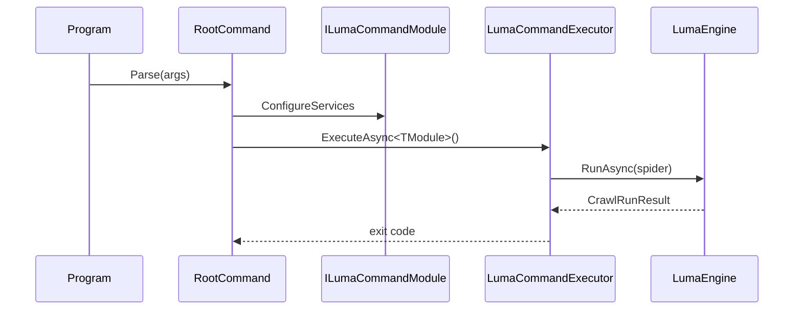

# Zeayii.Luma.CommandLine

[简体中文](./README.md) | English

The CommandLine module is the official host sample and is not a public package dependency.

## Module Positioning

1. Demonstrates `RootCommand` and provider subcommand composition.
2. Demonstrates host-level DI assembly with Engine and Presentation.
3. Demonstrates unified exit-code and lifecycle handling.

## Sequence

## External Guidance

1. Private projects should implement their own CLI host (for example `luma dmm ...`).
2. This module is not shipped as a public NuGet package.
3. This module is intended as a reference template for private host implementations.
