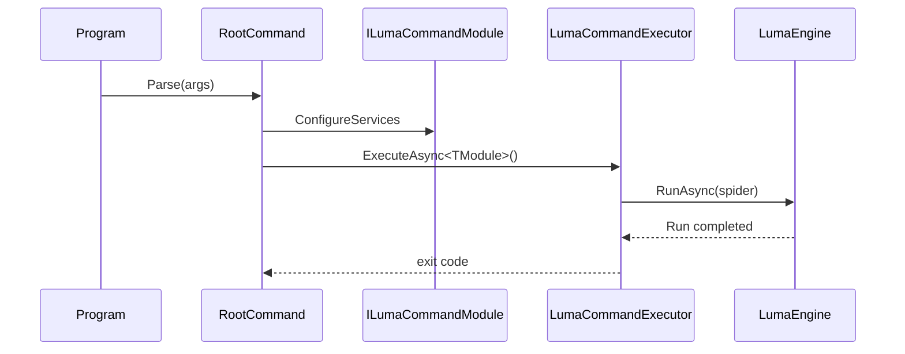

# Zeayii.Luma.CommandLine

简体中文 | [English](./README.en.md)

CommandLine 模块是官方示范宿主，不是公共发布依赖。

## 模块定位

1. 展示如何组装 `RootCommand` 与 provider 子命令。
2. 展示如何在宿主层装配 DI、Engine、Presentation。
3. 展示如何统一退出码和生命周期管理。

## 时序图

## 对外说明

1. 外部私有项目应自行实现命令行宿主（例如 `luma dmm ...`）。
2. 本模块不参与 NuGet 对外交付。
3. 本模块可作为私有命令行工程的参考模板。
