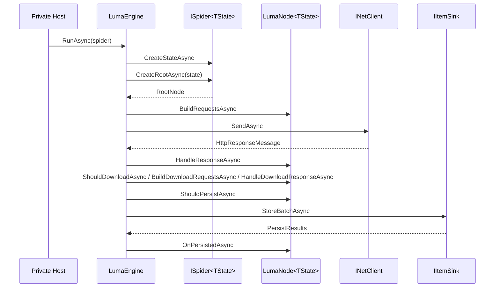

# Zeayii.Luma.Engine

[简体中文](./README.md) | English

The Engine module drives the Node lifecycle and runtime governance.

## Responsibilities

1. Schedule requests emitted by nodes.
2. Download requests and dispatch responses back to nodes.
3. Execute node lifecycle (BuildRequests / Handle / Download hooks / Persist hooks).
4. Persist items in batches and callback nodes.
5. Keep Cookie semantics aligned with HTTP session leases (HttpClient + CookieContainer), with node default route support.
6. Publish snapshots and run convergence decisions.

## Runtime Flow

## Scheduling Semantics

1. Nodes declare child expansion concurrency limits.
2. Engine expands children with structured concurrency semantics.
3. Engine enforces global concurrency and queue backpressure.

## Consumer Guidance

1. Providers should not implement their own scheduler.
2. Providers should not write directly to DB inside node logic.
3. Provider logic should stay inside node lifecycle methods.
