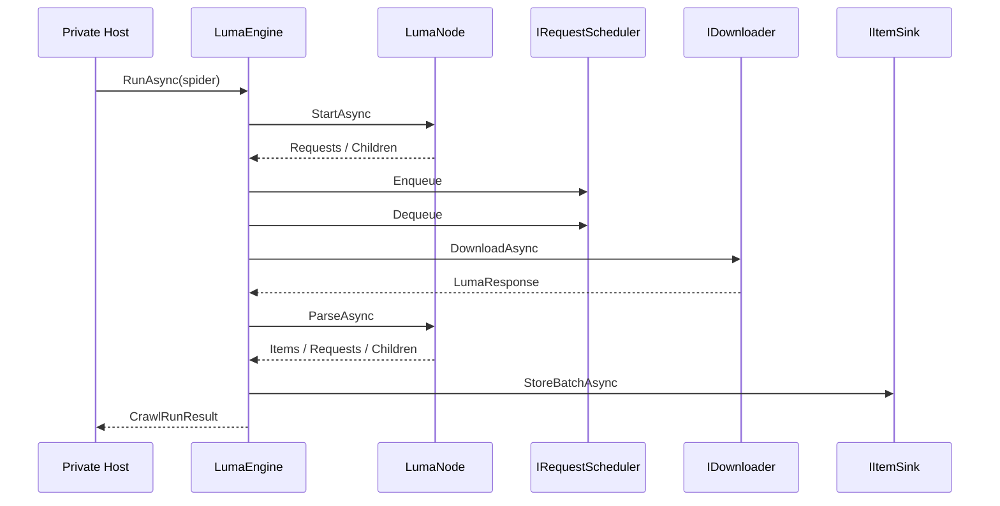
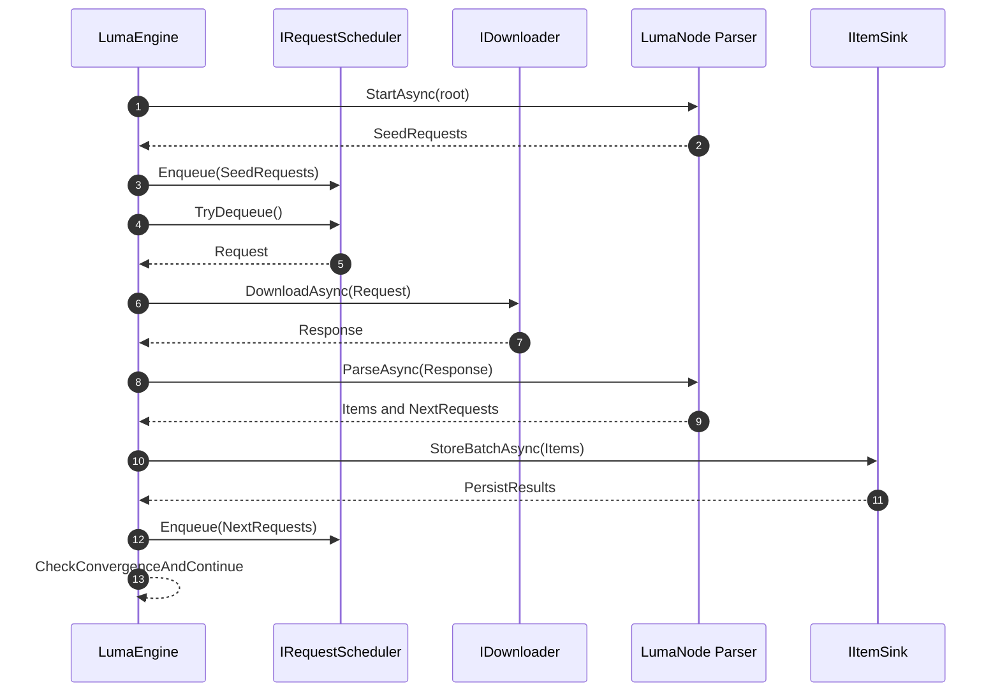

# Zeayii.Luma.Engine

[简体中文](./README.md) | English

The Engine module owns the crawling runtime loop and is the core execution dependency for private consumers.

## Responsibilities

1. Request scheduling and consumption.
2. Download orchestration and response dispatch.
3. Node parsing orchestration and child-node expansion.
4. Batch item persistence orchestration.
5. Completion convergence and stop decision.

## Runtime Flow

## Runtime Internal Sequence (GitHub Render Friendly)

## Key Semantics

1. Node registration and node-map updates must be atomic.
2. Completion waiting must be signal-driven (no fixed-delay polling).
3. Downloader must be streaming and body-size bounded.
4. Timeout, cancellation, and failures must converge through a unified stop path.

## Consumer Guidance

1. Private projects should reference this module directly.
2. Extend provider behavior through `ISpider/LumaNode/IItemSink`.
3. Do not embed provider-specific parsing logic into Engine itself.
