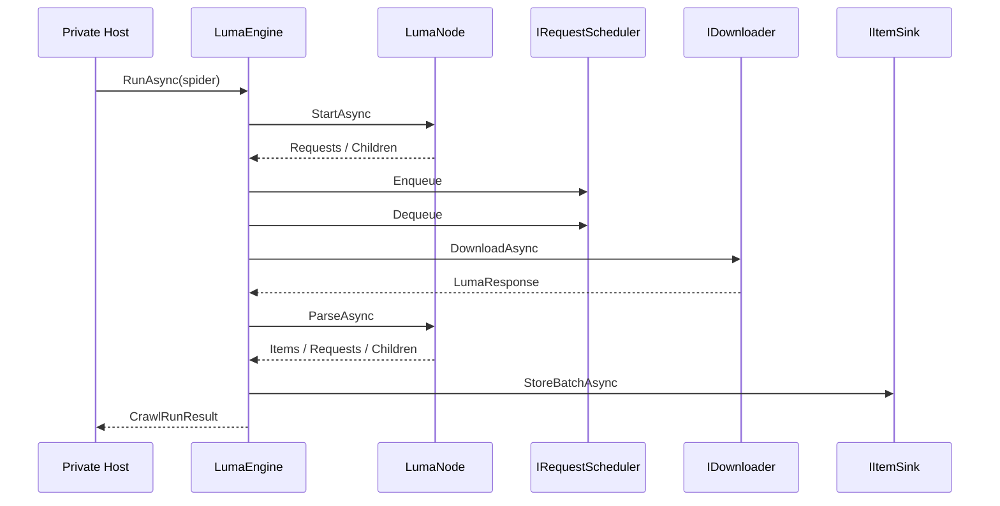
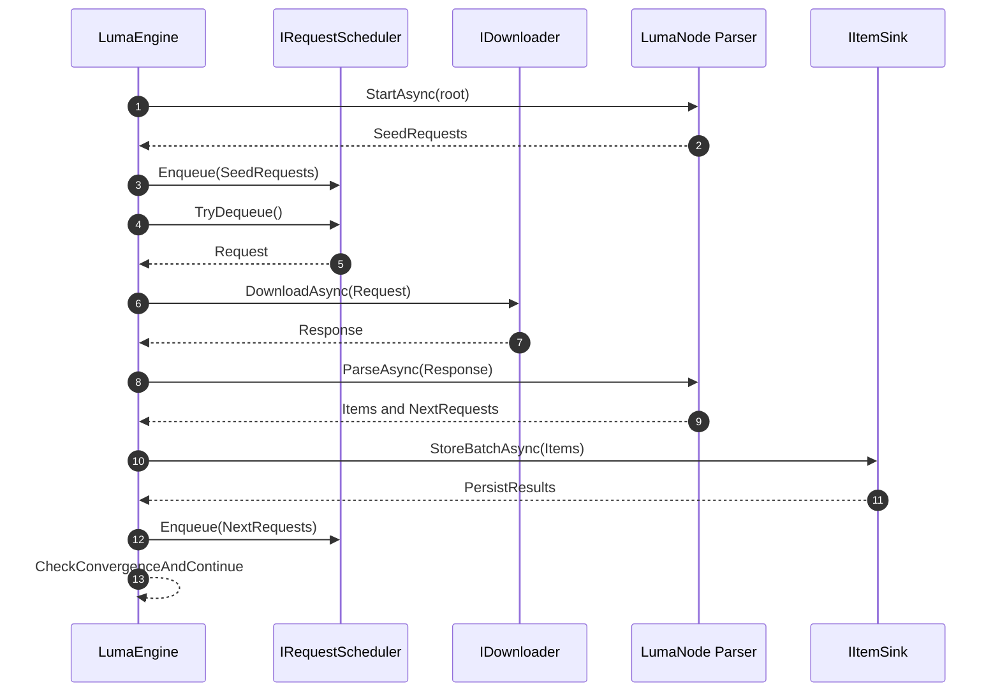

# Zeayii.Luma.Engine

简体中文 | [English](./README.en.md)

Engine 模块负责抓取运行时闭环，是外部私有项目的核心执行依赖。

## 职责

1. 请求调度与消费。
2. 下载驱动与响应分发。
3. 节点解析驱动与子节点扩展。
4. Item 批量持久化调度。
5. 运行完成收敛与停止判定。

## 运行流程

## 运行时内部时序（GitHub 渲染版）

## 关键语义

1. 节点注册与节点表更新必须原子化。
2. 完成等待必须使用信号驱动，不使用固定轮询延迟。
3. 下载器必须支持流式读取和响应体大小上限。
4. 请求超时、取消和失败都必须进入统一收敛流程。

## 外部项目使用建议

1. 私有项目直接依赖本模块。
2. 自定义 provider 逻辑通过 `ISpider/LumaNode/IItemSink` 扩展。
3. 不要在 Engine 模块内加入 provider 专属解析逻辑。
