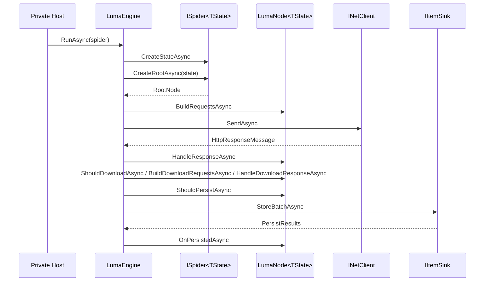

# Zeayii.Luma.Engine

简体中文 | [English](./README.en.md)

Engine 模块负责 Node 生命周期驱动与运行时治理。

## 职责

1. 调度节点产出的请求。
2. 下载请求并分发响应到节点。
3. 执行节点生命周期（BuildRequests / Handle / Download hooks / Persist hooks）。
4. 批量持久化数据项并回调节点。
5. 基于网络会话租约维护 Cookie 语义（HttpClient + CookieContainer 同会话），并支持节点默认路由。
6. 发布运行快照与停止收敛。

## 运行流程

## 调度语义

1. 节点声明子节点遍历策略（广度/深度）。
2. 节点声明子节点并发上限。
3. 引擎统一执行全局并发与队列背压。

## 外部项目接入建议

1. provider 不要实现自己的调度器。
2. provider 不要在节点中直接写数据库。
3. provider 应把业务逻辑收敛在节点生命周期函数中。
